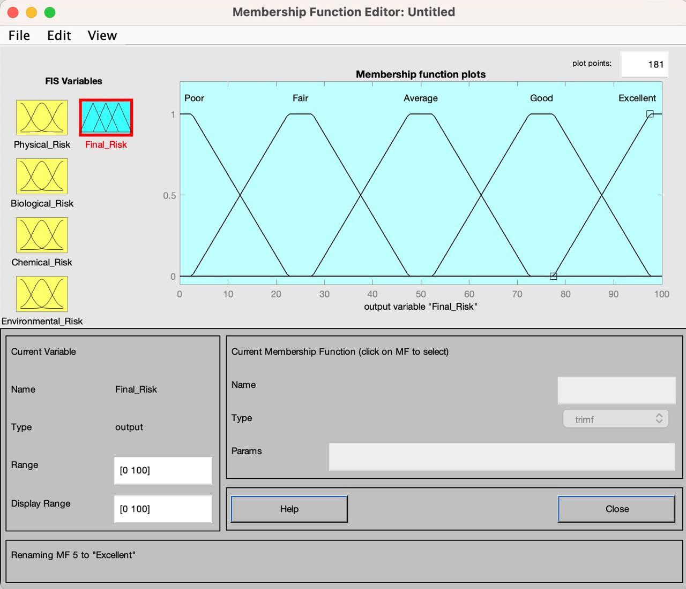

# Wheat Flour Products Manufacturing Risk Assessment

This repository contains the MATLAB models serving as a replication package for the submitted paper reported at the end of this file. This repository also contains additional material for the above-mentioned paper.

## Context
<!-- @Atrin: here a breif summary of the scope and the context of the paper (no more than 4 lines) --> 

## Structure of the repository
The repository is structured in the following folders:
<!-- @Atrin: describe the content of the folders --> 
* *[replication/edcc](replication/edcc/README.md)*: replication package for a scientific paper submitted to EDCC 2024.

## Additional Material
<!-- @Atrin: put some description of the figures and the figures as well -->

In the following figure, the Membership function of the Final Risk is reported.

## Replication Package
<!-- @Atrin: describe here the instructions on how to replicate the work (how to run the models) --> 

## License
The software is licensed according to the GNU General Public License v3.0 (see License file).

## People
* Atrin Barzegar - Università della Campania "Luigi Vanvitelli" (Italy)

## Credits
This software is build using Matlab R2023a, licensed to Universita' della Campania "Luigi Vanvitelli". The tools use the Fuzzy Logic Toolbox v.3.1.

## References
The figures and the replication package refer to the paper "Fuzzy Inference System for Risk Assessment of Wheat Flour Product Manufacturing Systems", submitted to the 28th International Conference on Knowledge-Based and Intelligent Information & Engineering Systems (KES 2024).

